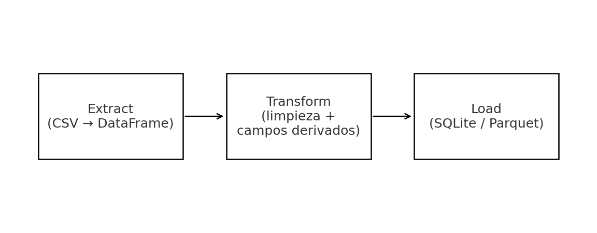

# Mini ETL de Datos de Ventas

Proyecto sencillo para practicar un flujo **ETL** con Python + pandas + SQLite.

## Estructura
```
mini-etl-ventas/
├── data/
│   ├── ventas.csv
│   └── (se generarán) ventas.db, ventas_limpias.parquet
├── src/
│   ├── etl.py
│   └── utils.py
└── requirements.txt
```

## Pasos rápidos (local con VS Code)
1. Crea y activa un entorno:
   - Windows: `python -m venv .venv && .venv\Scripts\activate`
   - macOS/Linux: `python3 -m venv .venv && source .venv/bin/activate`
2. Instala dependencias: `pip install -r requirements.txt`
3. Ejecuta el ETL: `python src/etl.py`

Al ejecutar, se creará `data/ventas.db` con la tabla `ventas_limpias`.
También intentará exportar `data/ventas_limpias.parquet` si `pyarrow` está disponible.

## Diagrama del flujo ETL


## Ejemplo de salida
(Contenido del archivo `docs/sample_output.md`)

## Qué practicar aquí
- Limpieza de nulos y tipos.
- Campos derivados (`total`).
- Normalización de texto.
- Carga en SQLite y export a Parquet.

## Próximos pasos (opcional)
- Cambiar SQLite por PostgreSQL.
- Añadir tests con `pytest`.
- Meterlo en un contenedor Docker.
- Crear un DAG simple en Airflow que llame a este script.
